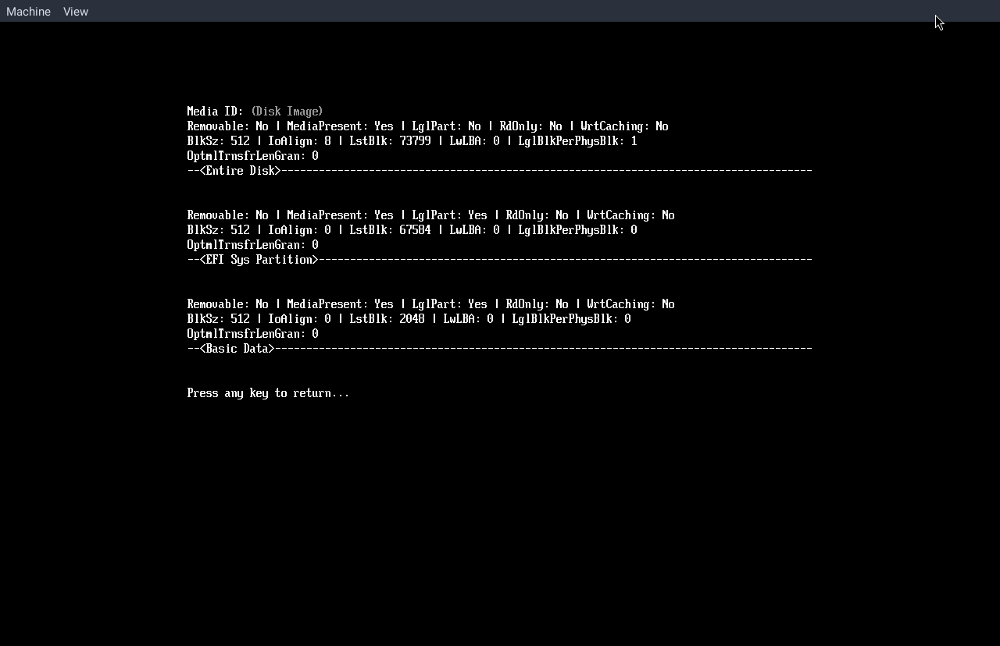

Making a simple UEFI bootloader/manager following Queso Fuego's UEFI dev series. \
I do plan on making a bootloader/manager truly my own without following a series (to an extent, there is a UEFI standard to follow).

**Dev tools needed:**
- qemu x86_64
- edk2-ovmf
- make
- x86_64-w64-mingw32-gcc
- `queso-fuego/UEFI-GPT-image-creator`

### Progress

**Day 2** 

    

    Simple block IO disk and partition viewer.
    

    

 

    

    Started work on the boot selector.
    

    

**Day 1** \
